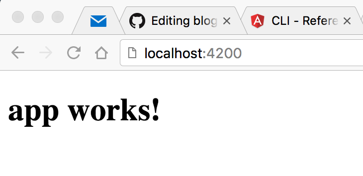
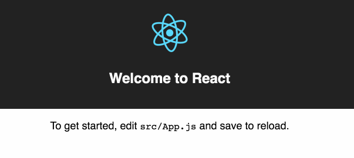
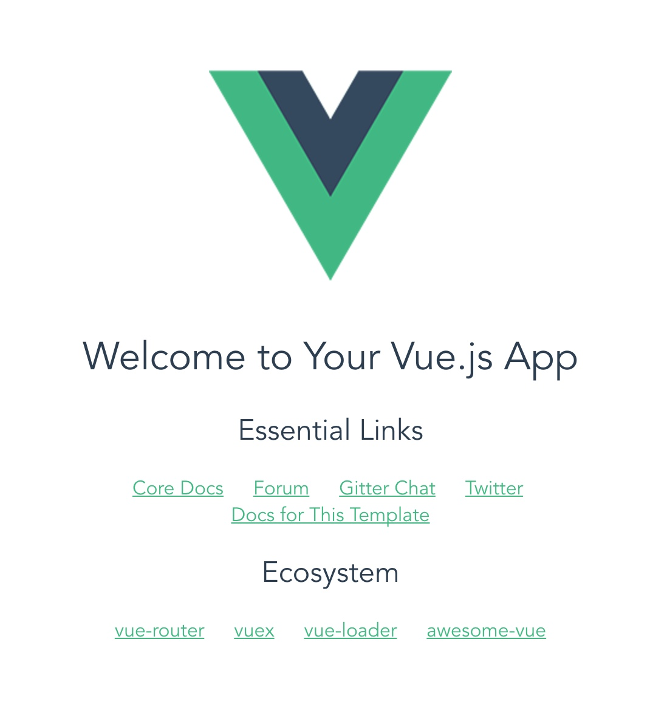

## React vs Angular vs Vue, A look at modern javascript framework CLIs

The rapid growth of javascript over the past few years has lead to a large variety of build tools and configuration options to get a simple application off the ground and running. This has been a [complaint](https://hackernoon.com/how-it-feels-to-learn-javascript-in-2016-d3a717dd577f) the JS community has been [suffering](https://medium.com/@ericclemmons/javascript-fatigue-48d4011b6fc4) for some time, which some refer to as JavaScript fatigue. Thankfully many popular frameworks are listening.

Projects such as [Angular](https://cli.angular.io/) and [React](https://github.com/facebookincubator/create-react-app) and [Vue.js](https://github.com/vuejs/vue-cli) all provide command line interfaces (CLIs) to quickly start building applications with little to no configuration required. In this post we'll see how easy it is to get up and running with a new application using each frameworks CLI.

## Creating Your Application
Creating an application in Angular, React or Vue is a breeze thanks to their CLIs. In this section we will take a quick look at just how easy it is to scaffold a new application in each framework.

### Angular
```bash
npm install -g angular-cli
ng new my-app
cd my-app
ng serve
```


### React
```bash
npm install -g create-react-app
create-react-app my-app
cd my-app
npm start
```


### Vue
```bash
npm install -g vue-cli
```
Vue gives users different template options to help them best their needs. Running `vue list` after you have installed the cli shows you each option with brief description of each.

```bash
$ vue list                                                                                                                                 
  Available official templates:

  ★  browserify - A full-featured Browserify + vueify setup with hot-reload, linting & unit testing.
  ★  browserify-simple - A simple Browserify + vueify setup for quick prototyping.
  ★  simple - The simplest possible Vue setup in a single HTML file
  ★  webpack - A full-featured Webpack + vue-loader setup with hot reload, linting, testing & css extraction.
  ★  webpack-simple - A simple Webpack + vue-loader setup for quick prototyping
```
After you decide which template you would like to use the installation and set up is similar to Angular and React but it does not run npm install in the background for you.
```bash
vue init webpack my-appy
cd my-app
npm install
npm run dev
```


## Additional features
Currently, the React and Vue CLIs are fairly simple and the core functionality they currently both provide is mainly to initialize a new application. On the other hand, the Angular CLI is much more feature complete and allows you to easily scaffold new components, directives, services, and even lets you build and deploy your application to GitHub pages. 

## Closing

It is pretty easy to see how much time and effort is saved using any of these CLIs comared to manually setting up each respective project yourself. In my mind this is a fantasic trend for Javascript frameworks. Many other languages/frameworks like Rails have been using generators for ages, and shifting users to follow convention over configuration is a great way to get developers developing instead of worrying about configuration until they really need it.

If you are interested in learning more about the Angular-CLI I highly reccomend looking at Mike Brocchi's talk from ng-conf 2016 which you can find [here](https://youtu.be/wHZe6gGI5RY). The [github repo](https://github.com/angular/angular-cli) for the project also has a lot of good information.

Additional info for the Create React App can be found on their [github page](https://github.com/facebookincubator/create-react-app). The [blog post](https://facebook.github.io/react/blog/2016/07/22/create-apps-with-no-configuration.html) which introduced the cli also has some good background explainging the need for a simiplier way to introduce users into javascript frameworks.

Info for the Vuejs CLI can be found on their [github page](https://github.com/vuejs/vue-cli) as well.
